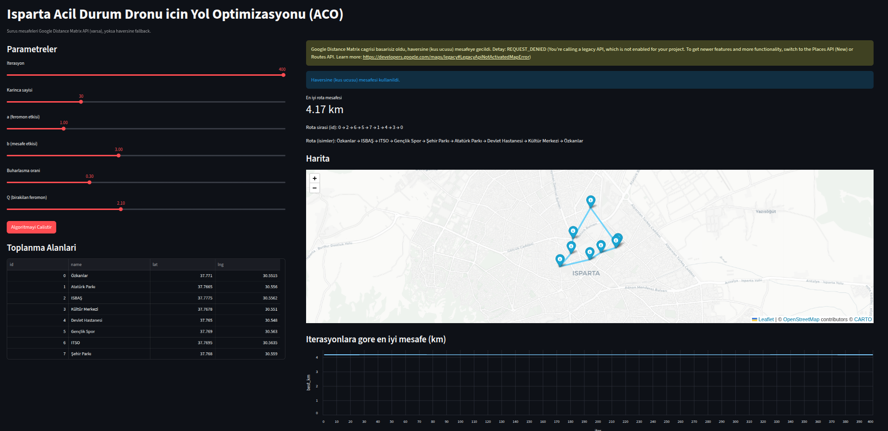

# ACO ile Isparta Afet Toplanma Alanlari Rota Optimizasyonu

Bu proje, **Senaryo 8** kapsaminda Isparta merkezde belirlenen afet ve acil durum toplanma alanlarina paket tasiyan
bir acil durum dronu icin en uygun rotayi bulmayi amaclar. Rota optimizasyonu **Karinca Kolonisi Algoritmasi (ACO)**
ile yapilir. Mesafe matrisi, **Google Distance Matrix API** (varsa) ile surus mesafesi olarak alinir; API yoksa veya
cagri basarisiz olursa **haversine (kus ucusu)** mesafesi kullanilir.

## Gorevler (Ozet)
- Toplanma alanlarinin koordinatlari belirlenir.
- Google Maps API ile surus mesafeleri alinip mesafe matrisi olusturulur.
- ACO ile en kisa tur bulunur.
- Streamlit arayuzu ile parametreler ayarlanir, en iyi rota harita uzerinde ve iterasyon grafigiyle gosterilir.

## Dizin Yapisi
```
aco_isparta_rotasi/
├─ main.py                  # Streamlit ana uygulama
├─ streamlit_app.py         # main.py icin uyumluluk sargisi
├─ config.py                # Varsayilan parametreler
├─ requirements.txt         # Kutuphaneler
├─ .gitignore
├─ .env                     # (yerel) API anahtari, gitignore
├─ .env.example             # API anahtari ornek dosya
├─ data/
│  └─ coordinates.py        # Toplanma alanlari
├─ core/
│  ├─ haversine.py          # Kus ucusu mesafe
│  ├─ matrix_utils.py       # Mesafe matrisi
│  └─ ant_algorithm.py      # ACO algoritmasi
├─ visual/
│  └─ plotting.py           # Harita ve grafik
├─ .streamlit/
│  ├─ secrets.toml           # (opsiyonel) API anahtari, gitignore
│  └─ secrets.toml.example   # API anahtari ornek dosya
└─ figure/                  # (opsiyonel) cikti görselleri, gitignore
```

## Kurulum
```bash
python3 -m venv .venv
source .venv/bin/activate
pip install -r requirements.txt
```

## API Anahtari (Gizlilik)
API anahtarini dosyaya yazmayin; `.env` veya `.streamlit/secrets.toml` kullanin.

**Secenek 1 (Yerel):** `.env`
```
GOOGLE_MAPS_API_KEY=YOUR_KEY
```

**Secenek 2 (Streamlit Cloud):** `.streamlit/secrets.toml`
```
GOOGLE_MAPS_API_KEY = "YOUR_KEY"
```

> `.env` ve `.streamlit/secrets.toml` dosyalari `.gitignore` icindedir.

## Calistirma
```bash
streamlit run main.py
```

Alternatif:
```bash
streamlit run streamlit_app.py
```

## Arayuzdeki Parametreler
- **Iterasyon:** ACO dongu sayisi
- **Karinca sayisi:** Her iterasyondaki karinca sayisi
- **a (alpha):** Feromon etkisi
- **b (beta):** Mesafe etkisi
- **Buharlasma orani:** Feromon buharlasmasi
- **Q:** Birakilan feromon miktari

## Notlar
- Google Distance Matrix API etkin degilse sistem otomatik olarak haversine mesafesine duser.
- Google API icin “Distance Matrix API” (Legacy) veya uygun yeni Routes hizmetini etkinlestirmeniz gerekebilir.
- `index.html` dosyasi, onceki Leaflet denemesidir; Streamlit uygulamasi icin gerekli degildir.

## Ekran Goruntusu


> API anahtarini repo'ya eklemeyin.
